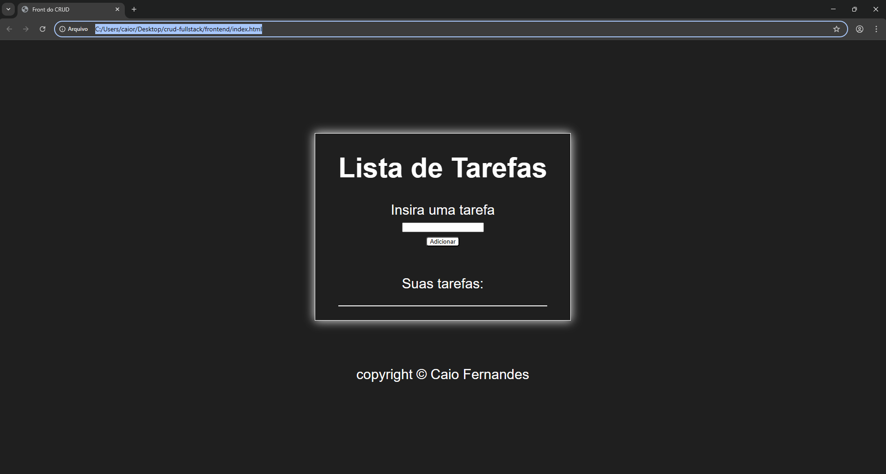

# CRUD Full Stack - Node.js + MySQL

Projeto de CRUD completo desenvolvido para praticar integração entre frontend e backend.

## Tecnologias utilizadas

- HTML
- CSS
- JavaScript
- Node.js
- Express
- MySQL

## Funcionalidades

-  Criar tarefas
-  Listar tarefas
-  Editar tarefas
-  Deletar tarefas

## Rotas da API

- `GET /tarefas` → lista todas as tarefas  
- `POST /tarefas` → cria uma nova tarefa  
- `PUT /tarefas/:id` → atualiza uma tarefa  
- `DELETE /tarefas/:id` → remove uma tarefa  

## Como rodar o projeto

### Backend

```bash
cd backend
npm install
node server.js
```

Servidor rodando em:
http://localhost:3001


### Frontend

Abra o arquivo:

frontend/index.html
(ou use Live Server)


## Aprendizados

- Integração entre frontend e backend
- Consumo de API com fetch
- Operações CRUD completas
- Uso de banco de dados MySQL


## Preview




## Autor

Caio Fernandes
