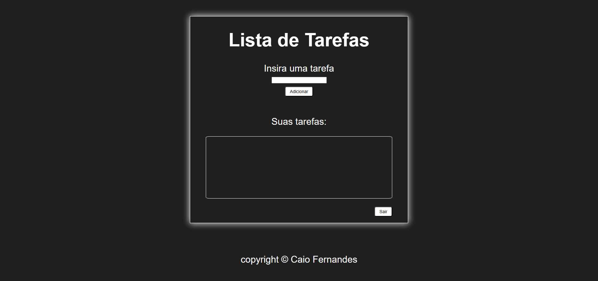
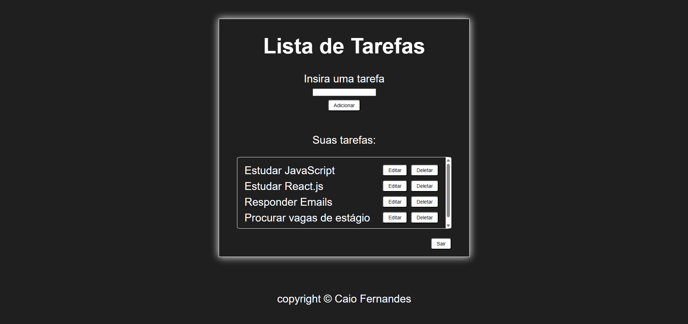

# CRUD Full Stack - Node.js + MySQL

Projeto full stack com autenticação de usuários e CRUD de tarefas, onde cada usuário acessa apenas seus próprios dados.

## Tecnologias utilizadas

- HTML
- CSS
- JavaScript
- Node.js
- Express
- MySQL
- JWT (autenticação)
- Bcrypt (criptografia de senha)

## Funcionalidades

-  Registro de usuário
-  Login com autenticação
-  Geração de token JWT
-  Proteção de rotas com middleware
-  Criar tarefas (por usuário)
-  Listar tarefas (somente do usuário logado)
-  Editar tarefas
-  Deletar tarefas

## Rotas da API

### Autenticação

- `POST /register` → cria usuário
- `POST /login` → autentica e retorna token

### Tarefas (protegidas)

- `GET /tarefas` → lista tarefas do usuário  
- `POST /tarefas` → cria tarefa
- `PUT /tarefas/:id` → atualiza tarefa  
- `DELETE /tarefas/:id` → remove tarefa  

## Como rodar o projeto

### Backend

```bash
cd backend
npm install
node server.js
```

Servidor rodando em:
http://localhost:3001

Copie o arquivo .env.example e renomeie para .env, preenchendo os valores.

### Frontend

Abra o arquivo:

frontend/index.html
(ou use Live Server)


## Aprendizados

- Autenticação com JWT
- Proteção de rotas no backend
- Hash de senha com bcrypt
- Integração entre frontend e backend
- Consumo de API com fetch
- CRUD completo com MySQL
- Organização de API REST


## Preview

### Login


### Sem tarefas


### Com tarefas



## Autor

Caio Fernandes
