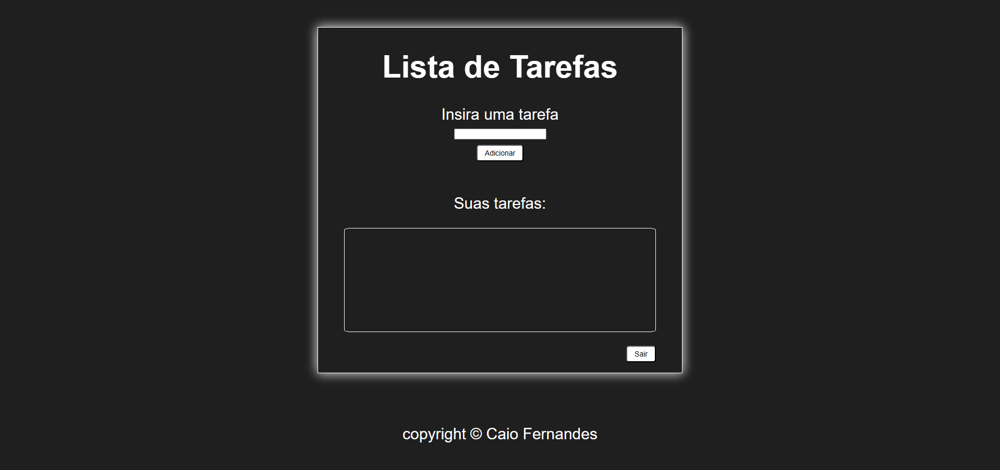
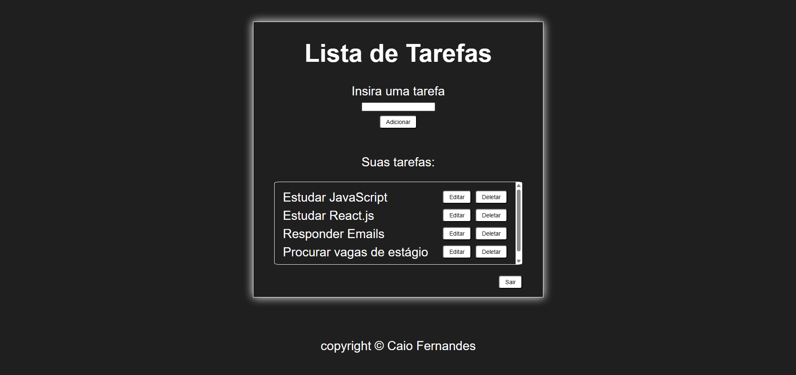

# CRUD Full Stack - Node.js + MySQL

Aplicação full stack de gerenciamento de tarefas com autenticação JWT e sistema multiusuário, desenvolvida com Node.js, Express e MySQL. Cada usuário possui acesso apenas às próprias tarefas, com rotas protegidas e persistência em banco de dados.

## Tecnologias utilizadas

- HTML
- CSS
- JavaScript
- Node.js
- Express
- MySQL
- JWT (autenticação)
- Bcrypt (criptografia de senha)

## Funcionalidades

-  Registro de usuário
-  Login com autenticação
-  Geração de token JWT
-  Proteção de rotas com middleware
-  Criar tarefas (por usuário)
-  Listar tarefas (somente do usuário logado)
-  Editar tarefas
-  Deletar tarefas

## Rotas da API

### Autenticação

- `POST /register` → cria usuário
- `POST /login` → autentica e retorna token

### Tarefas (protegidas)

- `GET /tarefas` → lista tarefas do usuário  
- `POST /tarefas` → cria tarefa
- `PUT /tarefas/:id` → atualiza tarefa  
- `DELETE /tarefas/:id` → remove tarefa  

## Deploy

- Frontend: https://crud-fullstack-node-mysql.vercel.app
- Backend: https://crud-fullstack-node-mysql.onrender.com

## Estrutura do projeto

```bash
frontend/
 ├── index.html
 ├── login.html
 ├── login.js
 ├── style.css

backend/
 ├── middleware/
 │    └── auth.js
 ├── server.js
 ├── package.json
 └── .env
```

## Variáveis de ambiente

Crie um arquivo `.env` dentro da pasta `backend/` com:

```env
JWT_SECRET=seu_segredo_jwt
DB_HOST=seu_host_mysql
DB_USER=seu_usuario_mysql
DB_PASSWORD=sua_senha_mysql
DB_NAME=nome_do_banco
DB_PORT=3306
```

## Como rodar o projeto

### Backend

```bash
cd backend
npm install
node server.js
```

Servidor rodando em:
http://localhost:3001

Copie o arquivo .env.example e renomeie para .env, preenchendo os valores.

### Frontend

Abra o arquivo:

Abra o arquivo `frontend/index.html`
ou utilize uma extensão como Live Server.


## Aprendizados

- Autenticação com JWT
- Proteção de rotas no backend
- Hash de senha com bcrypt
- Integração entre frontend e backend
- Consumo de API com fetch
- CRUD completo com MySQL
- Organização de API REST


## Preview

### Login


### Sem tarefas


### Com tarefas



## Autor

Caio Fernandes
